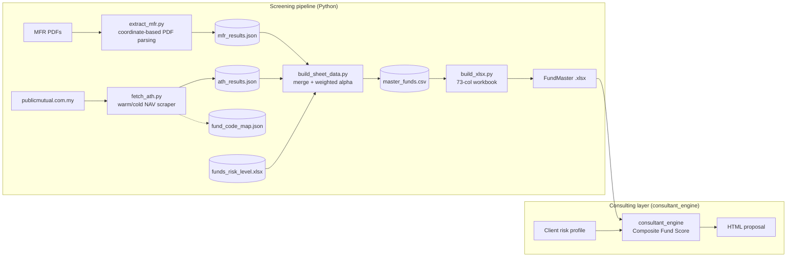
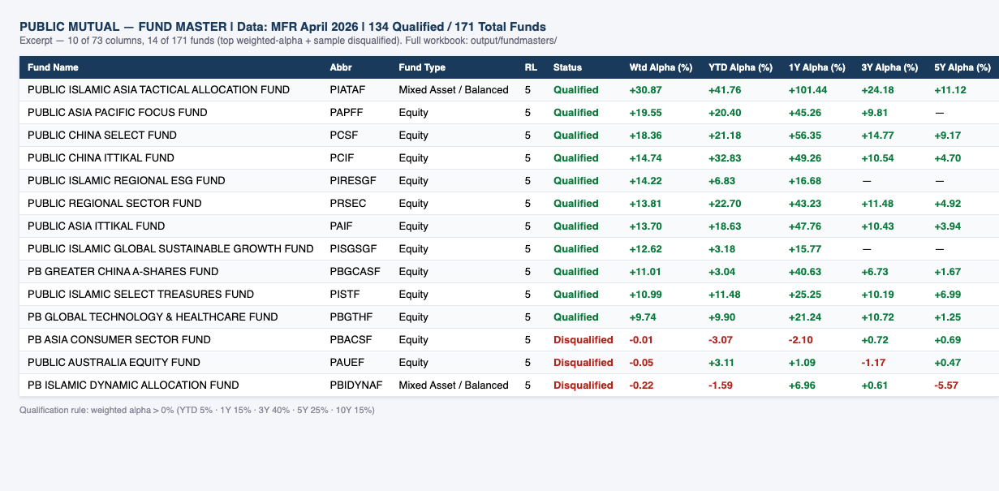
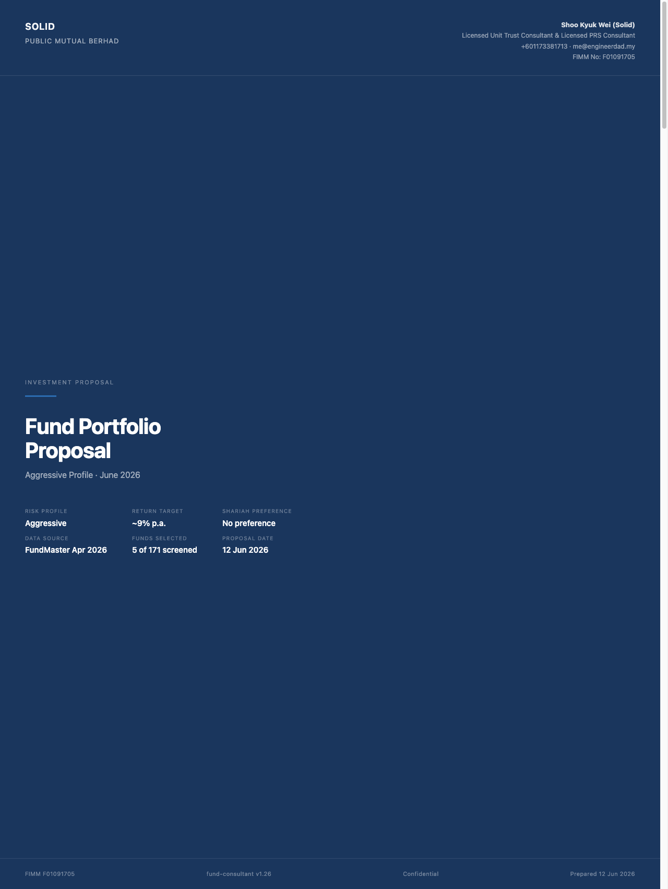
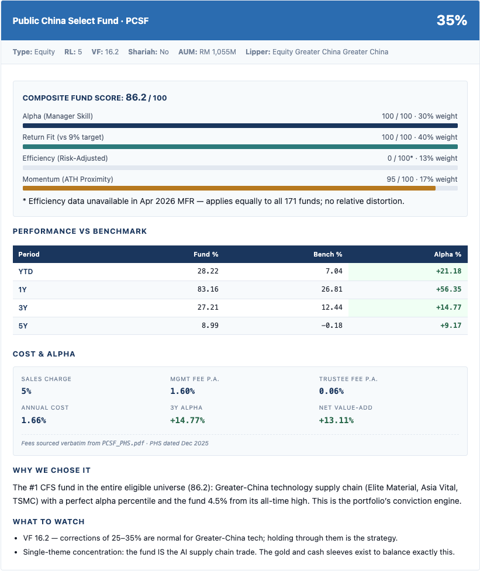
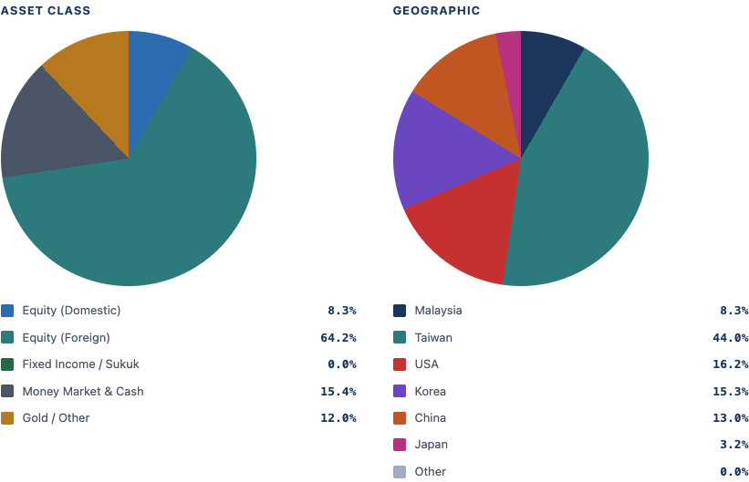

# Public Mutual Fund Analyzer

[](https://github.com/solidx86/public-mutual-funds-analyzer/actions/workflows/ci.yml)

A two-stage fund screening and advisory system in active monthly use by a licensed unit trust consultant in Malaysia. Stage one is a Python pipeline that parses Public Mutual's Monthly Fund Report PDFs with coordinate-based extraction, scrapes live NAV data from publicmutual.com.my, and scores all ~171 funds with a weighted-alpha model into a 73-column Excel "FundMaster" workbook. Stage two is an AI consulting layer — a headless LangGraph package (`consultant_engine`) — that reads the workbook plus a client's risk profile and generates a polished, compliance-aware HTML portfolio proposal, with a human-in-the-loop review gate. The interesting part is the seam between the two: deterministic, tested data engineering feeding a prompt-driven generation layer that is itself version-stamped, template-locked, and regression-checked.

## Architecture



## What's inside

- **2,700+ lines of Python** across a 4-stage pipeline, with **coordinate-based PDF extraction** (pdfplumber word bounding boxes) to handle the MFR's multi-column layouts that defeat naive text extraction.
- **Warm/cold web scraping** with CSRF handling and a persisted fund-code map: full NAV-history pull (~2 min) only on first run, ~30s monthly delta updates thereafter.
- A **weighted-alpha qualification model** (YTD 5% / 1Y 15% / 3Y 40% / 5Y 25% / 10Y 15%, with proportional redistribution when a fund lacks history) — replacing an earlier binary beat-rate gate so alpha *quality* drives qualification.
- **73-column Excel generation** (openpyxl) with conditional formatting and a formula-driven summary dashboard; month, version, and titles auto-derived from source data and skill frontmatter.
- The consulting layer is a **headless LangGraph package** (`consultant_engine`, currently v0.1.0) implementing a four-dimensional **Composite Fund Score** — Alpha, Return Fit, Efficiency, Momentum — with profile-adaptive weights, locked HTML templates, a shared design-system CSS, and CSS-only conic-gradient pie charts. Every proposal is automatically stamped with the engine version and an AI-generation disclaimer. A human-in-the-loop review gate pauses execution for consultant approval before finalising each proposal.
- **Eval-style regression tests for the LLM layer**: a deterministic proposal validator checks generated HTML against the locked template, recomputes scoring invariants, and enforces disclosure rules (e.g. an alpha warning must appear if and only if a recommended fund failed screening).
- **Edge-case engineering** earned in production: abbreviation normalization (`P SmallCap` vs `PSMALLCAP`), Shariah multi-line equity-split parsing, and a mandatory per-fund fee lookup from Product Highlight Sheets introduced after a real fee-inheritance bug.
- **Reproducible by design**: cached intermediate JSONs are tracked in git, so a fresh clone regenerates the full workbook offline — that's also how CI runs the pipeline end-to-end with zero network access.

## Showcase

**FundMaster workbook** — screening output across 171 funds (excerpt; sample workbook under [`output/examples/fundmasters/`](output/examples/fundmasters/)):



**Generated client proposal** — cover, per-fund recommendation card with Composite Fund Score bars, and portfolio exposure charts (full samples under [`output/examples/fund_proposals/`](output/examples/fund_proposals/)):







## Stack at a glance

Python (pdfplumber · openpyxl · requests · LangGraph) · Claude Code skills · HTML/CSS (no-JS charts) · Excel/Google Sheets · pytest + GitHub Actions

## Running it

The four pipeline steps run from the repo root (each script derives its paths from its own location):

```bash
pip install -r requirements.txt
python3 fund-screener-skill/scripts/extract_mfr.py        # MFR PDFs → data/cache/mfr_results.json
python3 fund-screener-skill/scripts/fetch_ath.py          # live NAV → data/cache/ath_results.json (~30s warm)
python3 fund-screener-skill/scripts/build_sheet_data.py   # merge + score → data/cache/master_funds.csv
python3 fund-screener-skill/scripts/build_xlsx.py         # → output/fundmasters/*.xlsx
```

Proposals are generated by the headless `consultant_engine` package with a consultant-review HITL gate:

```bash
python -m consultant_engine --profile <p.json> --fundmaster <wb.xlsx>
# → pauses for review; run --resume <thread_id> to finalise, or --no-review to auto-approve
```

Full pipeline semantics and troubleshooting live in [`fund-screener-skill/SKILL.md`](fund-screener-skill/SKILL.md).

Tests run offline from the tracked cached data:

```bash
pip install pytest && pytest
```

### Data files & provenance

Data files live under `data/` — cache files in `data/cache/` (all tracked so a fresh clone works offline) and manually-maintained reference data in `data/reference/`:

| File | What it is | Produced / maintained by |
|---|---|---|
| `data/cache/mfr_results.json` | Raw per-fund extraction from the latest MFR PDFs (~171 funds: performance, allocation, holdings) | `extract_mfr.py` |
| `data/cache/ath_results.json` | All-time-high NAV, drawdown %, and days-from-ATH per fund | `fetch_ath.py` |
| `data/cache/fund_code_map.json` | Persistent abbreviation → fund-code cache for the NAV API (the warm-run speedup) | `fetch_ath.py` |
| `data/reference/funds_risk_level.xlsx` | Authoritative 1–5 risk-level lookup joined in `build_sheet_data.py` | manually maintained from Public Mutual's published classifications |
| `data/reference/epf_qualified_funds.csv` | EPF i-Invest qualified funds — consultant reference only, not consumed by the pipeline | manually maintained reference |

- The source PDFs (Monthly Fund Reports, Master Prospectuses, Product Highlight Sheets) are official Public Mutual Berhad publications, copyright Public Mutual Berhad. They are **not redistributed in this public repo** — they live in a separate private repo and are mounted locally as gitignored symlinks (see [Public / private split](#public--private-split)). The pipeline runs from the tracked cached JSON above, so a fresh public clone works offline without them.
- Curated, generic (no-client) samples are tracked under [`output/examples/`](output/examples/) — the proposals are generated from the Apr 2026 FundMaster, which also lives there. Live skill output (`output/fund_proposals/`, `output/fundmasters/`) is a gitignored symlink into the private repo, so real (client-named) runs are never committed; a good generic run is promoted into `output/examples/` by hand.

## Roadmap

Planned enhancements and follow-up work are tracked in [`docs/tasks.md`](docs/tasks.md) — currently a deterministic CFS/fee engine for the consultant layer (ENH-1), a canonical single-source-of-truth data store the workbook renders from (ENH-2), and a durable, version-controlled consultant-profile file (ENH-3).

## Public / private split

This public repo ships the **engineering** — the screening pipeline, both skills, the tests, and curated example outputs. Three classes of material stay in a separate **private** repo (`public-mutual-funds-analyzer-private`) and are mounted in via gitignored symlinks, for copyright and regulatory reasons (a FIMM-registered consultant should not republish the management company's copyrighted documents, nor any client's personal data):

| Public (tracked here) | Private (mounted) |
|---|---|
| Pipeline, `fund-screener-skill/`, `consultant_engine/`, tests, `output/examples/` | `unit-trust/`, `private-retirement-scheme/` — copyrighted source PDFs |
| Cached `data/cache/*.json` (`mfr_results`, `ath_results`, `fund_code_map`) | `output/fund_proposals/` — real client proposals (client PII) |
| `data/reference/` (risk levels, EPF list) | `output/fundmasters/` — live FundMaster workbooks |

A fresh public clone runs the **pipeline and CI from the cached JSON with no network and no private data**; the private mounts are only needed to re-extract from source PDFs or to regenerate/back up real outputs.

### First-time setup

```bash
# 1. Python env
pip install -r requirements.txt pytest && pytest

# 2. Private data mounts (skip if you only need the public showcase)
git clone git@github.com:solidx86/public-mutual-funds-analyzer-private.git ~/Code/public-mutual-funds-analyzer-private
P=~/Code/public-mutual-funds-analyzer
Q=~/Code/public-mutual-funds-analyzer-private
ln -s "$Q/unit-trust"                "$P/unit-trust"
ln -s "$Q/private-retirement-scheme" "$P/private-retirement-scheme"
ln -s "$Q/client-proposals"                "$P/output/fund_proposals"
ln -s "$Q/fundmasters"                     "$P/output/fundmasters"

# 3. Make the screener skill available to Claude Code
ln -s "$P/fund-screener-skill"   ~/.claude/skills/fund-screener
```

## License & reuse

Source-available for portfolio/hiring review only — see [`LICENSE`](LICENSE). **All rights reserved**; no open-source license is granted (no use, redistribution, or deployment without written permission). If you'd like to discuss the work, reach out instead.

## Disclaimer

A personal technical portfolio project supporting a licensed consultant's own practice. It is **not affiliated with, endorsed by, or sponsored by Public Mutual Berhad**; "Public Mutual" and related marks belong to their owner. Fund figures are illustrative/derived for demonstration and are **not investment advice**; generated proposals are illustrative samples.
