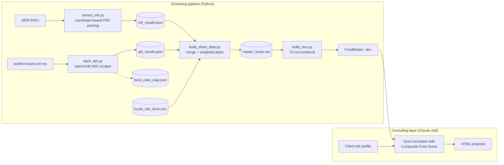

# Public Mutual Fund Analyzer

[](https://github.com/solidx86/public-mutual-funds-analyzer/actions/workflows/ci.yml)

A two-stage fund screening and advisory system in active monthly use by a licensed unit trust consultant in Malaysia. Stage one is a Python pipeline that parses Public Mutual's Monthly Fund Report PDFs with coordinate-based extraction, scrapes live NAV data from publicmutual.com.my, and scores all ~171 funds with a weighted-alpha model into a 73-column Excel "FundMaster" workbook. Stage two is an AI consulting layer — a versioned Claude Code skill — that reads the workbook plus a client's risk profile and generates a polished, compliance-aware HTML portfolio proposal. The interesting part is the seam between the two: deterministic, tested data engineering feeding a prompt-driven generation layer that is itself version-stamped, template-locked, and regression-checked.

## Architecture



## What's inside

- **2,700+ lines of Python** across a 4-stage pipeline, with **coordinate-based PDF extraction** (pdfplumber word bounding boxes) to handle the MFR's multi-column layouts that defeat naive text extraction.
- **Warm/cold web scraping** with CSRF handling and a persisted fund-code map: full NAV-history pull (~2 min) only on first run, ~30s monthly delta updates thereafter.
- A **weighted-alpha qualification model** (YTD 5% / 1Y 15% / 3Y 40% / 5Y 25% / 10Y 15%, with proportional redistribution when a fund lacks history) — replacing an earlier binary beat-rate gate so alpha *quality* drives qualification.
- **73-column Excel generation** (openpyxl) with conditional formatting and a formula-driven summary dashboard; month, version, and titles auto-derived from source data and skill frontmatter.
- The consulting layer is a **versioned Claude Code skill** (26 documented releases, currently v1.26) implementing a four-dimensional **Composite Fund Score** — Alpha, Return Fit, Efficiency, Momentum — with profile-adaptive weights, locked HTML templates, a shared design-system CSS, and CSS-only conic-gradient pie charts. Every proposal is automatically stamped with the skill version and an AI-generation disclaimer.
- **Eval-style regression tests for the LLM layer**: a deterministic proposal validator checks generated HTML against the locked template, recomputes scoring invariants, and enforces disclosure rules (e.g. an alpha warning must appear if and only if a recommended fund failed screening).
- **Edge-case engineering** earned in production: abbreviation normalization (`P SmallCap` vs `PSMALLCAP`), Shariah multi-line equity-split parsing, and a mandatory per-fund fee lookup from Product Highlight Sheets introduced after a real fee-inheritance bug.
- **Reproducible by design**: cached intermediate JSONs are tracked in git, so a fresh clone regenerates the full workbook offline — that's also how CI runs the pipeline end-to-end with zero network access.

## Showcase

**FundMaster workbook** — screening output across 171 funds (excerpt; full workbooks under [`output/fundmasters/`](output/fundmasters/)):


**Generated client proposal** — cover, per-fund recommendation card with Composite Fund Score bars, and portfolio exposure charts (full samples under [`output/fund_proposals/`](output/fund_proposals/)):


## Stack at a glance

Python (pdfplumber · openpyxl · requests) · Claude Code skills · HTML/CSS (no-JS charts) · Excel/Google Sheets · pytest + GitHub Actions

## Running it

The four pipeline steps run from the repo root (each script derives its paths from its own location):

```bash
pip install -r requirements.txt
python3 fund-screener-skill/scripts/extract_mfr.py        # MFR PDFs → mfr_results.json
python3 fund-screener-skill/scripts/fetch_ath.py          # live NAV → ath_results.json (~30s warm)
python3 fund-screener-skill/scripts/build_sheet_data.py   # merge + score → master_funds.csv
python3 fund-screener-skill/scripts/build_xlsx.py         # → output/fundmasters/*.xlsx
```

Proposals are generated interactively through the `fund-consultant` skill in Claude Code — see [`fund-consultant-skill/SKILL.md`](fund-consultant-skill/SKILL.md). Full pipeline semantics and troubleshooting live in [`fund-screener-skill/SKILL.md`](fund-screener-skill/SKILL.md).

Tests run offline from the tracked cached data:

```bash
pip install pytest && pytest
```

### Data provenance

- The PDFs under `Unit Trust (UT)/` and `Private Retirement Scheme (PRS)/` are official Public Mutual Berhad publications (Monthly Fund Reports, Master Prospectuses, Product Highlight Sheets), included solely as inputs for data extraction. All rights to those documents remain with Public Mutual Berhad.
- `funds_risk_level.xlsx` is a manually maintained lookup of Public Mutual's published fund risk levels (1–5).
- Sample proposals use fictitious client details.

## License & reuse

This repository is **source-available for portfolio review only**. © All rights reserved. No license is granted to use, copy, modify, or redistribute any part of this code or its outputs. If you'd like to discuss the work, reach out instead.

## Disclaimer

This is a personal engineering project supporting a licensed consultant's own practice. Nothing in this repository is financial advice, and generated proposals are illustrative samples.
