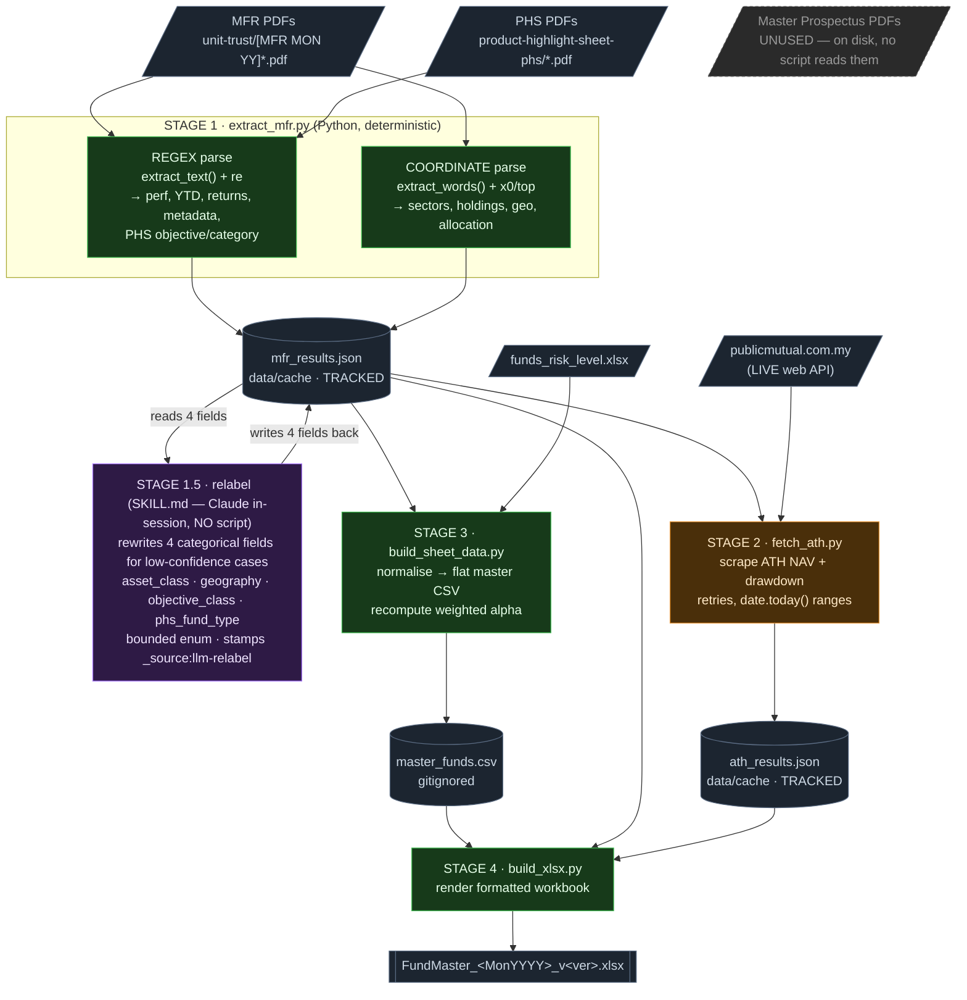
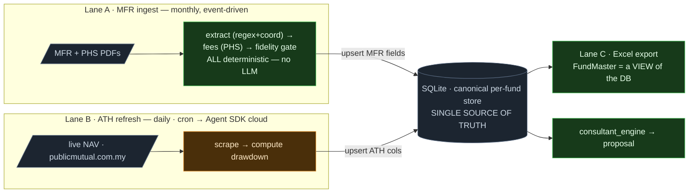
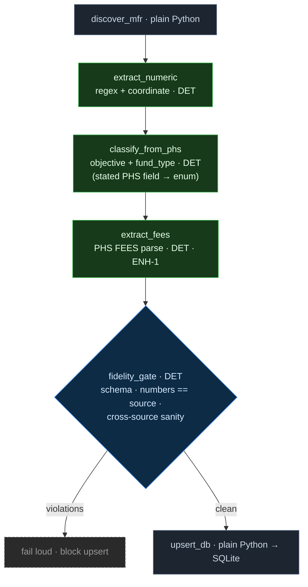
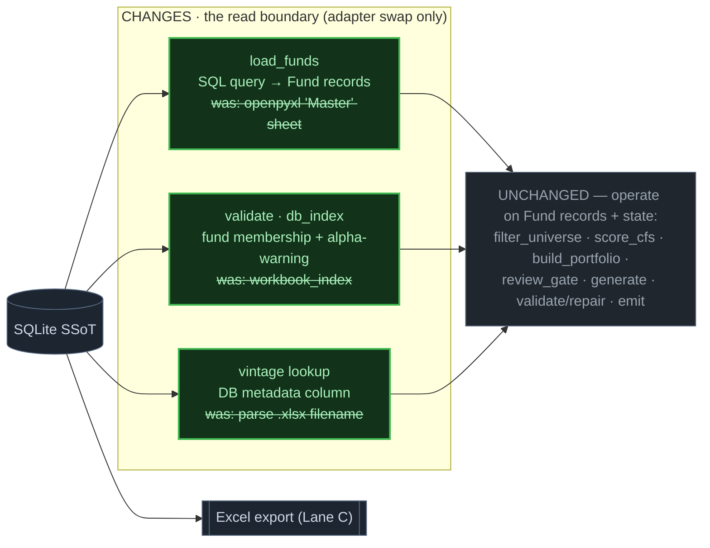
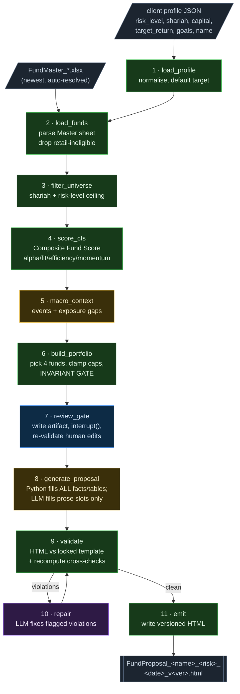
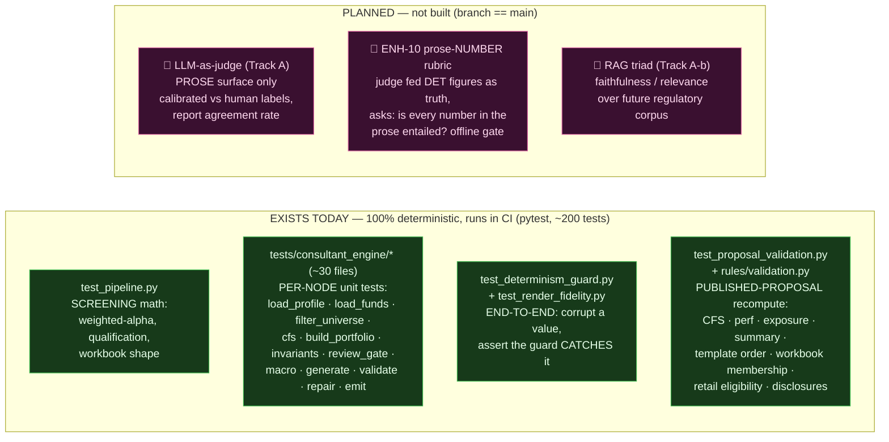

# Pipeline Determinism & Eval Map — DRAFT

> Working draft to build shared clarity. Goal: for every component, make it obvious
> **(a) what feeds in, (b) whether it is deterministic or not, and (c) how — if at all — it is tested.**
> Iterate freely; nothing here is locked.

## How to read this — the arc

This doc moves through three lenses; read top-to-bottom, or jump:

1. **AS-IS** — what runs *today*, and where its determinism / test coverage has gaps. → [Pipeline 1 · extraction](#pipeline-1--screening--extraction--as-is-today--mfr-pdfs--web--fundmaster-workbook), [Pipeline 2 · consultant](#pipeline-2--consultant-engine--as-is--fundmaster-workbook--client-profile--html-proposal)
2. **TARGET** — where it's *going*: three decoupled lanes, a SQLite single-source-of-truth, a deterministic screening side (the [Step 1.5 relabel is retired](#decision-2026-07-06--retire-the-step-15-relabel)), and one LangGraph island left — the consultant's (Strategy A). → [Target Architecture](#target-architecture--strategy-a--three-decoupled-lanes-sqlite-ssot)
3. **EVAL** — how any of it is *tested*: deterministic recompute today, LLM-as-judge planned. → [Testing & Eval](#the-testing--eval-picture--whats-real-vs-planned)

One idea sits under all three: **Python owns numbers; the LLM owns categories & adjectives.** Every
determinism and testing decision follows from which side of that line a thing lives on.

---

## The one idea to hold onto

Both pipelines start **messy and non-deterministic** (PDF layout heuristics, live web scrapes, LLM
labels/prose) and are deliberately funnelled down into **deterministic Python that owns every number**.

```
   non-deterministic INGEST   ──►   deterministic CORE   ──►   fenced LLM (numbers already fixed)
   (PDF parse, web scrape,           (all math, all tables,       (categories + prose only — cannot invent
    LLM label / prose)                all validation)              a number; number slots are pre-filled)
```

The design rule, stated everywhere in the code: **Python owns numbers, the LLM owns categories &
adjectives.** In *both* pipelines the LLM is fenced to non-numeric work — Step 1.5 lets it relabel 4
enum-bounded categorical fields; the consultant lets it write prose slots — and a deterministic test
guards the fence. Every testing decision falls out of *which side of that line* a thing lives on.

> **Refinement (2026-07-06 decision — see [Retire the Step 1.5 relabel](#decision-2026-07-06--retire-the-step-15-relabel) below).** The screening side no longer needs the LLM at all: two of its four relabel fields (`objective_class`, `phs_fund_type`) come from a **stated PHS field** and are 171/171 deterministic, and the other two (`asset_class`, `geography`) are **synthesized labels no consumer reads** — so they're dropped. In the target, *screening owns categories in Python too*; the LLM's only home is **consultant prose**. The line sharpens to: **Python owns everything factual (numbers *and* categories); the LLM owns only adjectives.**

---

## Legend (visual language used below)

| Marker | Meaning |
|---|---|
| 🟩 **DET** | Deterministic Python — regex parse, coordinate parse, math, render. Same input → same output. Testable by exact recompute. |
| 🟧 **NON-DET (ingest)** | Non-deterministic by *source*: PDF-layout heuristics, live network, `date.today()`. Same logic, unstable input/world. |
| 🟪 **LLM** | Non-deterministic by *model*: Step 1.5 categorical relabel (enum-bounded) or consultant prose. **Never writes a number.** |
| 🟦 **HITL** | Human-in-the-loop gate. A person approves before the flow continues. |
| ⬛ **DEAD** | On disk but unused by any code (e.g. the Master Prospectus PDFs). |
| ✅ **DET-TEST** | Covered today by a deterministic test (recompute a number, assert equality within tolerance). Runs in CI. |
| 🔮 **JUDGE (planned)** | Intended LLM-as-judge coverage. **Does not exist yet** — designed in `docs/tasks.md`, not built. |
| ⬜ **UNTESTED** | No automated coverage today. |

---

## Pipeline 1 — Screening / Extraction  (AS-IS today · MFR PDFs + web → FundMaster workbook)

> **This section documents the *current* implementation.** The [Target Architecture](#target-architecture--strategy-a--three-decoupled-lanes-sqlite-ssot) below rescopes it into three decoupled lanes around a SQLite single-source-of-truth. Read this to understand what exists; read that to understand where it's going.

Four Python scripts under `fund-screener-skill/scripts/`, run from repo root — **plus one in-session
LLM step (Step 1.5) that lives in `SKILL.md`, not in any script.** Correcting an earlier claim: the
*scripts* contain no LLM, but the *pipeline* does — a bounded, enum-guarded classification relabel that
Claude Code performs by hand during a skill run. **The LLM never touches a number; it only re-labels 4
categorical fields.**

Inside `extract_mfr.py` there are two distinct **deterministic** parsing techniques worth separating:

- 🟩 **REGEX** — `re.search` over `page.extract_text()`: fund name/abbr, performance table, YTD, annual returns, metadata (launch date, NAV, volatility, Lipper, benchmark), PHS objective/category keyword-classify.
- 🟩 **COORDINATE** — `page.extract_words()` + x0/top geometry: right-column split at `x0 ≥ 0.52·width`, y-bucketed lines → sectors, top-5 holdings, geo breakdown, asset allocation.



### Stage-by-stage: input → output → technique → determinism → test

| Stage | Input | Output | Technique | Determinism | Tested? |
|---|---|---|---|---|---|
| **1 · extract_mfr** | MFR PDFs, PHS PDFs | `mfr_results.json` | 🟩 regex + coordinate (`pdfplumber`) | 🟧 **NON-DET *source*** — same PDF → same output, but brittle to layout changes | ⬜ **not tested against the PDF** (output checked in as fixture) |
| **1.5 · relabel** | `mfr_results.json` (4 fields) | `mfr_results.json` (same 4 fields) | 🟪 **LLM** (Claude in-session, no API/script) | 🟪 **NON-DET *model*** — but bounded to enums, `_source` audit-flagged | ✅ `test_relabel.py` — enum conformance + pinned corrections (7 asset_class + 15 geography flags live) · ▶ **Target: retired entirely** — see [Decision](#decision-2026-07-06--retire-the-step-15-relabel) |
| **2 · fetch_ath** | `mfr_results.json`, `fund_code_map.json`, **live web** | `ath_results.json` | HTTP scrape | 🟧 **NON-DET** — live scrape, retries, `date.today()`; changes daily | ⬜ not tested against the web |
| **3 · build_sheet_data** | `mfr_results.json`, `funds_risk_level.xlsx` | `master_funds.csv` | pure transform | 🟩 **DET** — re-derives weighted alpha from period detail | ✅ `test_pipeline.py`: coverage, qualification rule, **weighted-alpha math** |
| **4 · build_xlsx** | `master_funds.csv`, both JSONs, `SKILL.md` | `FundMaster_*.xlsx` | openpyxl render | 🟩 **DET** (only cosmetic "Generated <date>" footer varies) | ✅ `test_pipeline.py`: shape, 73 cols, sheets, version-stamped name |

**Three levels of determinism in one pipeline:** (1) non-deterministic *ingest* — PDF parse + web scrape, robust to re-runs but not to layout/world change; (1.5) non-deterministic *model* — the LLM relabel, fenced to categorical fields and enum-guarded; (3–4) deterministic *core*. The ingest outputs are **frozen as tracked JSON fixtures** so the core can be tested offline.

> **The two real gaps** (both about *source fidelity*, not internal consistency):
> - **Stages 1 & 2 have no test against their source.** A PDF-layout misread or a bad scrape becomes a wrong number in `mfr_results.json`, and every downstream recompute test still passes green — they recompute *from* the corrupted value. Garbage-in, self-consistent-garbage-out.
> - **Step 1.5's number-safety is only conventional.** `test_relabel.py` proves the 4 fields hold valid enum values, but nothing stops the LLM from *also* editing a protected numeric field during a hand-run. The plan's "NEVER modify performance/holdings" rule is enforced by discipline + a suggested (not wired) protected-field diff, not by a hard gate. ▶ **The target resolves this by deletion** — the [Decision](#decision-2026-07-06--retire-the-step-15-relabel) removes the LLM step, so there is no un-gated model write left to worry about.
>
> **This is the design case for the [Target Architecture](#target-architecture--strategy-a--three-decoupled-lanes-sqlite-ssot) below (= ENH-1/ENH-2 + ATH decoupling):** make MFR ingest a single owned lane with a typed schema + source-fidelity gate writing to the SQLite SSoT, instead of the LLM relabel and numeric extraction both editing a raw JSON blob.

---

<a id="target-architecture--strategy-a--three-decoupled-lanes-sqlite-ssot"></a>
## Target Architecture — Strategy A · three decoupled lanes, SQLite SSoT

> **Status: design target, not built** (= ENH-1 + ENH-2, plus the ATH decoupling). Chosen orchestration:
> **Strategy A ("islands only")** — LangGraph is used *only* where there's a cycle/HITL; everything else is
> plain Python or a scheduled job. The **database is a SQLite file in-repo**, and it is the single source of
> truth: every producer writes to it, every consumer reads from it.

<a id="decision-2026-07-06--retire-the-step-15-relabel"></a>
### Decision (2026-07-06) — retire the Step 1.5 relabel; drop `asset_class` + `geography`

**Decided:** remove the in-session LLM relabel (SKILL.md Step 1.5) **entirely**, and drop `asset_class` and
`geography` as fields. Keep `objective_class` (col E) and `phs_fund_type` (col D) as **plain deterministic
PHS-sourced fields** — no LLM. **Sequencing: do this jointly with the MFR→SQLite→Excel rework below, not as an
isolated edit to `extract_mfr.py`.**

**Why — the evidence (tracked 171-fund dataset):**

| Field | LLM edits | Source doc | In workbook? | Read downstream? | Verdict |
|---|---|---|---|---|---|
| `asset_class` | 7 | MFR (name + Lipper string) | **no** (dead fallback in `build_sheet_data.py`, never fires) | **no** | synthesized label, no consumer → **drop** |
| `geography` | 15 | MFR (name + Lipper string) | **no** — dropped by `build_xlsx.py` before the sheet | **no** (consultant reads numeric `Geo:` cols, not the string) | synthesized label, no consumer → **drop** |
| `objective_class` | **0** | **PHS** — stated "Fund objective" | yes (col E) | display | deterministic 171/171 → **keep, no LLM** |
| `phs_fund_type` | **0** | **PHS** — stated "Category of Fund" | yes (col D) | consultant `fund_type` | deterministic 171/171 → **keep, no LLM** |

Two facts kill the relabel's value: (1) all 22 LLM edits land in the two fields **no consumer reads**, while
the two fields that *are* consumed got **zero** edits; (2) `asset_class`/`geography` have **no source cell to
be correct against** — they're synthesized from the MFR name + Lipper string, so the "truth" is itself a
judgement (e.g. **PFSF** is labelled `United States` while its own extracted geo numbers are Taiwan-heavy).
`objective_class`/`phs_fund_type`, by contrast, read a **stated PHS field** and only need transcribe-and-map,
which is why deterministic Python is already perfect on them.

**Architectural consequence — the screening side loses its LLM *and* its only LangGraph.** With the relabel
gone there is no LLM, no cycle, and no HITL anywhere in screening. So **Lane A does not need to be a LangGraph
island** (contrast the earlier draft below): all three lanes become **plain deterministic Python + a
scheduler**. The `fidelity_gate` still earns its place, but as a **deterministic source-fidelity assertion**,
not an LLM-guarding router. The **only LangGraph left in the whole system is the consultant's**
`generate → validate → repair` loop. The Step-1.5 number-safety gap doesn't get *fixed* — it **ceases to
exist**.

---

Three lanes with **no code dependency on each other** — they meet only at the database. ATH is on its own
schedule (it's a daily NAV refresh; MFR is a monthly event), so it must not sit inside the MFR pipeline.



### Lane A — plain deterministic Python (no LangGraph, post-decision)

Per the [Decision](#decision-2026-07-06--retire-the-step-15-relabel) above, the relabel LLM is gone — so Lane A
has no cycle, no HITL, and no model call. It is a **straight-line deterministic Python pipeline**: extract →
fees → fidelity gate → upsert. The `fidelity_gate` stays, but it is now a **deterministic assertion** (schema
+ numbers-match-source + cross-source sanity), not an LLM-guarding router. There is **no LangGraph island
here** — the earlier "islands" draft is struck through below to show what the decision removed.



> **What the decision removed (was in the earlier draft):** a LangGraph subgraph wrapping
> `relabel_llm → fidelity_gate → repair` (+ optional HITL) — the same shape as the consultant's
> `generate → validate → repair`. With the relabel retired, that whole island is deleted; `asset_class` and
> `geography` are dropped, and `objective_class`/`phs_fund_type` are produced by the deterministic
> `classify_from_phs` step (they read a **stated** PHS field, so no model is needed). The `fidelity_gate`
> survives as a plain deterministic check.

### Lanes B & C — also *not* graphs (nor is anything on the screening side, now)

| Lane | Shape | Why no LangGraph |
|---|---|---|
| **A · MFR ingest** | `discover → extract → classify(PHS) → fees → fidelity_gate → upsert` | **Post-decision: fully deterministic, no cycle/HITL/LLM.** A straight Python function with a hard gate — no state graph needed. |
| **B · ATH refresh** | `load_fund_codes(DB) → scrape_nav → compute_drawdown → upsert_db` | Linear, no cycle/HITL. Runs on a **schedule**: cron now, then an **Agent SDK** agent (one web-fetch tool) on Anthropic cloud. A scheduler is the right tool, not a state graph. |
| **C · Excel export** | `read_db → render_workbook → write_xlsx` | Pure deterministic function. The workbook is a **materialized view** of the DB, regenerated on demand — the DB is the truth. |

> **Net orchestration after the decision:** the **entire screening side is plain Python** (Lanes A + C) **+ a
> scheduler** (Lane B). "Strategy A — islands only" now has exactly **one island left, and it's the
> consultant's** `generate → validate → repair` loop. Screening no longer touches LangGraph at all.

### What the target changes (as-is → to-be)

| Concern | Today (as-is) | Target (Strategy A) |
|---|---|---|
| **ATH coupling** | A stage wired *between* MFR extract and workbook build | **Independent Lane B** on its own schedule (cron → Agent SDK); meets MFR only at the DB |
| **Source of truth** | JSON blob + CSV + the `.xlsx` itself | **SQLite file** — one SSoT; workbook + consultant both read it |
| **Excel** | The authoritative output | A **view** rendered from the DB on demand |
| **Orchestration** | 4 scripts run by hand + a skill step | Plain Python (Lanes A + C) + a scheduled agent (Lane B) — **no LangGraph on the screening side** |
| **Ingest ownership** | Split across 2 scripts + skill + ad-hoc consultant fee read | Lane A owns MFR ingest end-to-end into the DB |
| **Categorical relabel (Step 1.5)** | In-session LLM rewrites 4 enum fields | **Retired.** `asset_class`/`geography` **dropped** (no consumer); `objective_class`/`phs_fund_type` produced by deterministic `classify_from_phs` |
| **Fees** | Not extracted — proposal shows `—` | **First-class field** (ENH-1 deterministic PHS parse) |
| **Master Prospectus** | ⬛ dead on disk | Feeds the **regulatory corpus** (future Track-B RAG) |
| **Number fidelity** | Untested vs source — cascade risk | `fidelity_gate` (deterministic) spot-checks numbers vs PDF + cross-source |
| **LLM number-safety** | Convention only ("never edit numbers") | **Moot — no LLM in screening to fence** |
| **Provenance** | `_source` on 2 relabeled fields | `_source` on **every** field (regex / coord / phs-classify / fee-parse) — no `llm-relabel` |

**The payoff:** the source-fidelity gaps close *structurally, not by discipline*; ATH stops being an
artificial dependency; the LLM (and its un-gated number-safety risk) leaves the screening side entirely; and
each tool is used for its strength — plain Python for all deterministic ETL, a scheduled agent for ATH, and
one SQLite SSoT tying it all together. LangGraph is reserved for the one place a real cycle/HITL lives: the
consultant's `generate → validate → repair` loop.

### The consultant reads the DB, not the workbook (target)

Here's the elegant part: because the consultant already operates on typed `Fund` records + graph state,
swapping its source from the `.xlsx` to the SQLite SSoT is a **narrow adapter at the read boundary — not a
graph change.** Only three touchpoints move; the entire selection/scoring/generation machinery is untouched.



**What moves (3 touchpoints):**

| Touchpoint (today) | Reads | Target |
|---|---|---|
| `load_funds` (`openpyxl.load_workbook` → Master sheet) | the `.xlsx` | **SQL query** → same `Fund` records |
| `cli._latest_fundmaster` (globs newest `*.xlsx`) | the filesystem | **gone** — the DB is always current; no file resolution |
| `validate.workbook_index` (`check_funds_in_workbook`, alpha-warning biconditional) | the `.xlsx` | **`db_index`** — same checks, DB-backed |
| `generate_proposal._workbook_month_year` (parses the filename for MFR vintage) | the filename | **DB metadata column** for the vintage |

**Two wins that fall out for free:**
- **Fees become real.** Today the fee table renders `—` ("Fees pending PHS extraction"). The DB carries the ENH-1 fee fields, so `load_funds` brings them into the `Fund` records and the table fills — a *content* change, no structural change.
- **Proposal and workbook can't drift.** Today the validator cross-checks the proposal against a *separately-produced* workbook that can be stale. In the target, the consultant and the Excel export are **two views of the same SQLite SSoT** — they cannot disagree by construction.

> Everything below (Pipeline 2) documents the **AS-IS** consultant that reads the workbook. The only delta to
> reach the target is the read-boundary swap above; the node graph, the determinism boundary, and the eval
> tiers are identical.

---

## Pipeline 2 — Consultant Engine  (AS-IS · FundMaster workbook + client profile → HTML proposal)

LangGraph package `consultant_engine/`. Linear graph with one HITL pause and one validate→repair loop.
**Only 2–3 nodes ever call the LLM; every number is computed in Python before prose is written.**



### Node-by-node: what it does, and where the LLM is (and isn't)

Every node has a **direct** unit test (`tests/consultant_engine/*` — ~30 files, ~200 tests), plus
end-to-end determinism guards and the published-proposal recompute regression. There is **no
"indirect-only" node** — the "Tested?" column below cites the file that targets each node directly.

| Node | Input | Output | Class | Tested? (direct) |
|---|---|---|---|---|
| 1 · load_profile | client profile JSON | normalised profile | 🟩 DET | ✅ `test_load_profile.py` (11) — target default/note, name edge cases |
| 2 · load_funds | FundMaster xlsx | eligible funds, retail-filtered | 🟩 DET | ✅ `test_load_funds.py` (5) — shariah parse, exclusions, overlap; + retail check in validator |
| 3 · filter_universe | eligible funds + profile | filtered universe | 🟩 DET | ✅ `test_filter_universe.py` (6) — shariah × risk ceiling |
| 4 · score_cfs | filtered funds | CFS scores (4 dims) | 🟩 DET | ✅ `test_cfs.py` (22) + CFS recompute in validator |
| 5 · macro_context | source flag, model | macro events + exposure gaps | 🟪 **LLM only if `--macro live`**; else fixture (🟩) | ✅ `test_macro.py` + `test_macro_agent.py` (9) — fixture/cache/fallback paths |
| 6 · build_portfolio | funds, CFS, gaps | 4-fund portfolio + allocation | 🟩 DET — **invariant gate raises** (sum=100, 4 funds, caps, gold+MM) | ✅ `test_build_portfolio*.py` (27) + `test_invariants.py` (11) |
| 7 · **review_gate** | portfolio, thread_id | approved / corrected portfolio | 🟦 **HITL** — pauses, human edits `data/review/<id>.json`, edits re-validated | ✅ `test_review_gate.py` (17) + interrupt/resume in `test_graph_skeleton.py` |
| 8 · generate_proposal | portfolio, CFS, profile, macro | proposal HTML | 🟨 **HYBRID** — Python fills every number/table/chart; **LLM writes prose slots only** (`why.*`, `watch.*`, macro impact) | ✅ `test_generate_proposal.py` + `test_determinism_guard.py` + validator recompute |
| 9 · validate | proposal HTML, workbook | violation list | 🟩 DET — the core eval logic (`rules/validation.py`) | ✅ `test_validate_node.py` + `test_validation_rules.py` + `test_render_fidelity.py`; **also the published-proposal eval layer** |
| 10 · repair | violations, HTML | patched HTML | 🟪 **LLM** — only runs when validation fails; bounded to 3 tries then hard-fail | ✅ `test_repair_node.py` (fail-loud after cap) + output re-validated (node 9) |
| 11 · emit | final HTML | versioned `.html` file | 🟩 DET | ✅ `test_emit.py` (10) — filename/version/name sanitisation |

**Key placement facts**
- The **HITL gate (7) sits after the portfolio is fixed but before prose is written** — the human approves *the numbers/allocation*, not the wording.
- The **only prose author is node 8**; the **only reactive LLM is node 10 (repair)**; **macro (5) is LLM only in `--macro live`**. Everything else is pure Python.
- `CONSULTANT_ENGINE_FAKE_LLM=1` stubs all three (prose → `[KEY narrative]` placeholders, macro → fixture, repair → canned), so the whole graph runs deterministically offline.

---

## The testing / eval picture — what's real vs. planned

This is the part that's genuinely confusing, so here it is explicitly.



### How each *kind* of content is (or will be) checked

| Content kind | Owner | How it's checked | Status |
|---|---|---|---|
| Numbers in **tables / cards / charts** (CFS, alpha, allocation, exposure, fees, RSP) | 🟩 Python | **Deterministic recompute** — extract the displayed number, recompute from source, assert equality within tolerance | ✅ **Built, in CI** |
| **Locked template** (section order, disclosures, version stamp, retail eligibility, unfilled slots) | 🟩 Python | Deterministic structural assertions / set-membership | ✅ **Built, in CI** |
| Numbers the LLM writes **inside free-text prose** (no HTML anchor, e.g. "nearly 78% beats benchmark") | 🟪 LLM prose | LLM-judge fed the deterministic figures as ground truth, asks "is every prose number entailed?" | 🔮 **Planned (ENH-10)** |
| **Qualitative prose** ("why this fund", "what to watch") — tone, relevance, no hallucinated claims | 🟪 LLM prose | LLM-as-judge on a rubric, calibrated against human labels | 🔮 **Planned (Track A-a)** |
| Prose claims needing a **regulatory source passage** | 🟪 LLM prose | RAG triad (faithfulness / context relevance) | 🔮 **Planned (Track A-b)** |

### Why the split is drawn exactly there

> A recompute is a *hard assertion* — the right tool for a number. An LLM-judge is *fuzzy,
> probabilistic judgement* — the wrong tool for a number the system already knows exactly,
> but the **only** tool for free-text prose the deterministic validator structurally cannot see.
> So: **every number that has an HTML anchor is recomputed deterministically; the LLM-judge is
> reserved for the prose surface** (and prose-embedded numbers with no anchor). Source: `docs/tasks.md`
> lines 272-277, 295-301, 495-534.

**The honest current state:** there is **no LLM-as-judge running anywhere yet**. The `track-a-eval-harness`
branch is byte-identical to `main`. Today, correctness rests entirely on (a) Python owning every anchored
number and (b) deterministic recompute tests. The judge is the *next* layer, for the fuzzy surface those
tests can't reach.

---

## Open questions for you (let's iterate)

1. **Scope** — do you want this as *one* combined diagram, or the current three views (extraction / consultant / eval overlay)?
2. **Audience** — is this for you to reason with, or a README-facing artifact for reviewers? (Changes how much prose vs. how much diagram.)
3. **The "untested ingest" gap** (Stages 1–2 PDF/scrape) — worth calling out visually as a risk, or out of scope?
4. **Planned vs. built** — keep the 🔮 planned layer in the picture (I think yes — it's the source of your confusion), or split into "as-is" and "to-be" diagrams?
5. Want an **HTML companion** of this (per the repo's spec convention) once we settle the shape?
